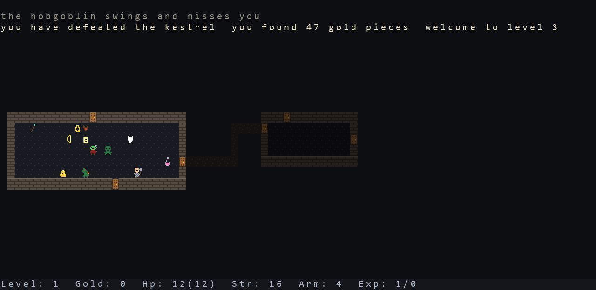

# Rogue

**Version 1.0.2**

A graphical port of **Rogue 5.4.5** — the original 1980s dungeon crawl — to Python
and pygame, in a single file with no assets.



## What this is

This is a *port*, not a tribute. The dungeon generator, the monster tables, the
combat formulas, the item probabilities and the daemon/fuse scheduler are all
carried across value-for-value from the authentic
[Rogue 5.4.5 C source](https://github.com/RoguelikeRestorationProject/rogue5.4)
released by the Roguelike Restoration Project — the final UNIX version by
Michael Toy, Ken Arnold and Glenn Wichman. Where the C does something odd,
the odd thing is ported and a comment says so.

What is new is the presentation. curses is replaced by a pygame tile grid, and
the artwork is 61 hand-drawn 8×12 sprites — 26 animated monsters, a hero who
wears what he is actually carrying, and every weapon and armour drawn as itself.

Everything lives in `rogue.py`: ~10,400 lines, one file, no data files, no
images, no external fonts.

Two version numbers appear and they mean different things: **5.4.5** is the
Rogue being ported, **1.0.2** is this port. In game, `v` reports both.

## Running it

Needs **Python 3.13** and **pygame** — nothing else. (pygame has no wheels for
Python 3.14 yet, so use 3.13.)

```
pip install pygame
python rogue.py
```

```
python rogue.py --seed 42        a reproducible dungeon
python rogue.py --ascii          the original character grid instead of sprites
python rogue.py --selftest 2000  2000 turns headless; exits nonzero on any error
```

## Controls

| | |
|---|---|
| `h j k l` | move left, down, up, right |
| `y u b n` | move diagonally |
| arrows, keypad | the same |
| **hold a direction** | keep walking; stops for anything worth a look |
| `H J K L Y U B N` | run until something interesting |
| `^H ^J ^K ^L …` | run, but stop at doors |
| `.` | rest a turn |
| `,` | pick up |
| `s` | search for secret doors |
| `> <` | stairs down, up |

| | | | |
|---|---|---|---|
| `i` | inventory | `q` | quaff a potion |
| `I` | inventory one item | `r` | read a scroll |
| `d` | drop | `e` | eat |
| `w` | wield a weapon | `z` | zap a wand or staff |
| `W` | wear armour | `t` | throw |
| `T` | take armour off | `f` `F` | fight, fight to the death |
| `P` | put on a ring | `c` | name an unidentified item |
| `R` | remove a ring | `a` | repeat the last command |

| | |
|---|---|
| `?` | help |
| `D` | what you have discovered |
| `/` | identify a symbol on the map |
| `^` | identify a trap |
| `^P` | recent messages |
| `@` | repeat the status line |
| `o` | options |
| `0`–`9` | repeat count, e.g. `10s` to search ten times |
| `Q` | quit |
| `ESC` | cancel |

## What is faithful, and what is not

Everything about the *rules* is faithful: monster stats, to-hit and damage
maths, the 3×3 room grid and its corridors, maze rooms, trap odds, hunger and
regeneration timings, the experience curve (which caps at level 21, as in the
original), and every potion, scroll, ring and wand effect.

Five deliberate departures, all of them about playing on a modern screen:

- **Sleeping monsters hold still; awake ones move.** This is the only change
  that affects information the player has. In real Rogue you cannot tell a
  sleeping monster from an alert one until it acts.
- **Weapons and armour are drawn as themselves on the floor.** The original
  shows every weapon as `)`. A weapon's *type* is not secret — the game names
  it as soon as you pick it up — so nothing is given away. Potions, scrolls,
  rings and wands keep one generic sprite each, because *their* identity is
  randomised per game and discovering it is the point.
- **No `--More--`.** The original had one 80-column line for messages at the
  top of a 24-line terminal, so a second message had nowhere to go and the game
  stopped and waited. Here there are three lines and messages roll off the top.
  `^P` shows the log.
- **Hold a direction to walk.** It stops on damage, on a monster coming into
  view or getting close, on entering a new room, on standing on something, or
  on being blocked — and needs the key released before it will go again.
- **No saved games and no score file.** `state.c` is 1,450 lines of C-struct
  serialisation and the score file is 1980s multi-user plumbing; neither
  affects the game you play.

Turn off the graphics with `--ascii`, or the animation and hold-to-walk with
`o`, and what is left behaves like the original.

## How the graphics work

There are no image files. The deliverable is one Python file, so the artwork
*is* code — each sprite an 8×12 grid of characters indexing a fixed palette:

```python
SPRITES[POTION] = """
kkk33kkk
kkk11kkk
kk3113kk
k311113k
k3hhhh3k
...
```

That is not a workaround; it is how 8-bit hardware stored tiles — a small fixed
palette, a low-resolution cell, colour indices rather than RGB. Sprites are
rasterised once at startup and scaled with nearest-neighbour, never smoothed,
so the pixels stay hard-edged. The hero is composed in layers — body, then
armour, then weapon — because 8 armours × 9 weapons × 4 poses is 288
combinations and nobody should draw those by hand.

The art is checked at startup: every row 8 wide, every sprite 12 tall, every
colour known, every weapon and armour present and distinguishable. A typo
fails loudly instead of showing up as a blank tile mid-game.

## Verifying it

```
python rogue.py --selftest 2000 --seed 42
```

Runs 2,000 turns headlessly with scripted input and exits nonzero on any
exception. `--seed` is fully reproducible: the same seed gives the same
dungeon every time.

## Licence

The ported game is Rogue, and its licence travels with it:

> Rogue: Exploring the Dungeons of Doom
> Copyright (C) 1980-1983, 1985, 1999 Michael Toy, Ken Arnold and Glenn Wichman
> All rights reserved.

BSD 3-clause. The full notice is at the top of `rogue.py`, as condition 1 of
that licence requires. The original source is preserved by the
[Roguelike Restoration Project](https://github.com/RoguelikeRestorationProject/rogue5.4).
